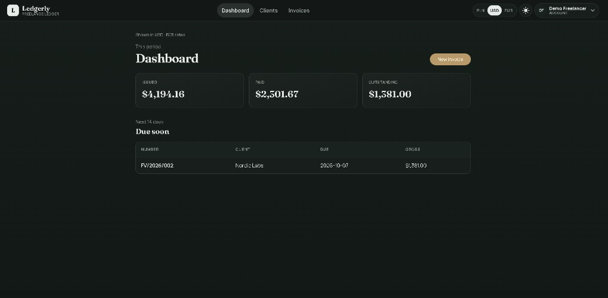

# Ledgerly

Web app for freelancers / small businesses: **clients → invoices → payment status → revenue summary**.

Stack: Java 21, Spring Boot 4, Angular, PostgreSQL, Docker Compose.

## Showcase

Dashboard in dark mode - period totals, upcoming due invoices, currency switch (PLN / USD / EUR) and theme toggle.

<p align="center">
  
</p>

## What this project demonstrates

- REST API with JWT - each owner sees only their own data (`userId`)
- automatic invoice numbering (`FV/2026/001`) + net / VAT / gross totals
- status workflow `DRAFT → SENT → PAID` (and `CANCELLED`)
- display currency conversion (PLN / USD / EUR) via ECB rates
- light / dark theme
- one-command local run: `docker compose up --build`

## Requirements

- Docker + Docker Compose **or**
- Java 21, Maven, Node 20+, PostgreSQL 16

## Quick start (Docker)

```bash
docker compose up --build
```

- Frontend: http://localhost
- API / Swagger: http://localhost:8080/swagger-ui.html
- PostgreSQL: `localhost:5432` (`ledgerly` / `ledgerly`)

Register in the UI, add a client, create an invoice, move it to `SENT` / `PAID`, and check the dashboard.

Demo account (seeded): `demo@ledgerly.dev` / `Demo1234!`

## Local development

### Database

```bash
docker compose up db -d
```

### Backend

```bash
cd backend
# Windows: point JAVA_HOME at JDK 21
./mvnw spring-boot:run
```

API: http://localhost:8080

### Frontend

```bash
cd frontend
npm install
npm start
```

UI: http://localhost:4200 (`environment.apiUrl` points at the API)

## API (overview)

| Method | Path | Description |
|--------|------|-------------|
| POST | `/api/auth/register` | register |
| POST | `/api/auth/login` | login (JWT) |
| CRUD | `/api/clients` | clients (search `?q=`) |
| CRUD | `/api/invoices` | invoices + filters |
| PUT | `/api/invoices/{id}/status` | change status |
| GET | `/api/dashboard/summary` | totals + upcoming due dates |
| GET | `/api/rates` | PLN → USD / EUR display rates |

## Model

`User 1-N Client`, `User 1-N Invoice`, `Invoice 1-N InvoiceItem`

## Out of scope for MVP

KSeF, Stripe, multi-currency invoicing (display conversion only), system admin roles, PDF / CSV (nice-to-have later).

## Branches and commits

See `docs/BRANCHING.md` and `.cursor/rules/`. Commit messages and UI copy are English.
